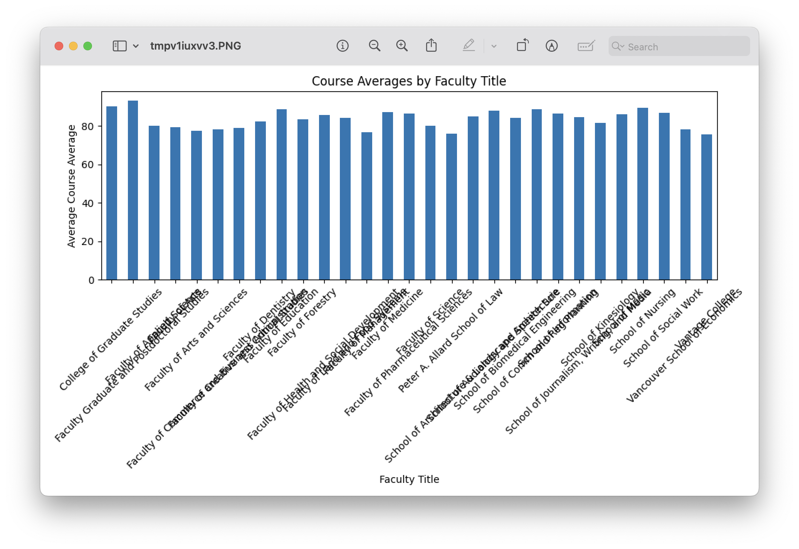
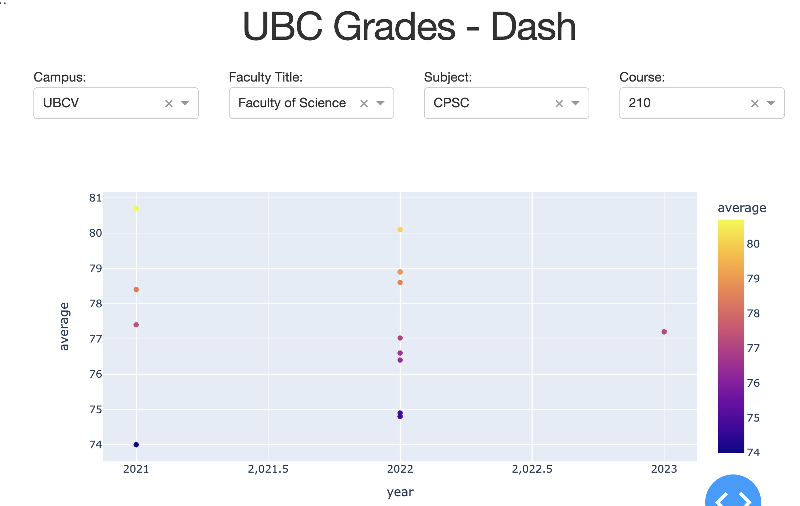

# UBC Grades - Dash
Building off of the original incredible [ubcgrades.com](ubcgrades.com) project, I am utilizing [Plotly's Dash](dash.plotly.com) system to analyze and visualize UBC grade data.
Additionally, I am utilizing genAI and data analysis with OpenAI and pandasai.

## Data sources
From the [ubcgrades.com API](https://ubcgrades.com/api-reference/v3), I can receive grades distributions as json objects, then transform them into dataframes for python and plotly to manage.

For example
`https://ubcgrades.com/api/v3/grades/UBCV/2022S`

## IN DEVELOPMENT
see [my playground jupyter notebook](playground2.ipynb) for current progress

## Screenshots

## Future developments
- [x] tidy up imports with requirements.txt
- [x] create a dash app mvp
- [x] showcase sample plotly charts in screenshots
- [x] refine openai outputs
- [x] create dash app with charts that match what is currently on ubcgrades.com
- [ ] find/make a chatgpt interface on dash
- [ ] improve markdown on ipynb file
- [x] separate out helper functions
- [x] improve UI of charts
- [ ] host application and database and functions on the cloud. Ex: GCP Cloud Run, Cloud Store, Cloud Functions. Or Render.com. Docker image would be great too.

## Curent priorities
- [ ] filter dropdowns
- [ ] show "OVERALL" section by defaul
- [ ] year x axis only has 3 options 2021, 2022, 2023. Not 2021.5
- [ ] capitalize labels (axis, legend)
- [ ] give larger marker to the "OVERALL" vs the sections - not sure if this is possible (conditional markers)

## Questions I'd like to be able to answer
- SELECT campus, subject, course where average > 90
- questions: what courses in 3rd and 4th year can I take that have the highest average?
- what courses have the lowest fail rate? (<50 or <55%)
- how do grades compare between sections of the same class?
- how do grades compare between profs over the years/classes?
- does class size influence grades?
- what subjects (CPSC, MATH, etc) have the highest averages?
- what MATH 1xx courses have the highest and lowest averages?